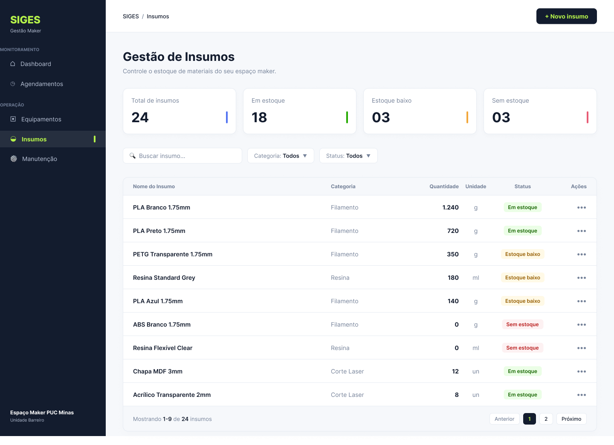
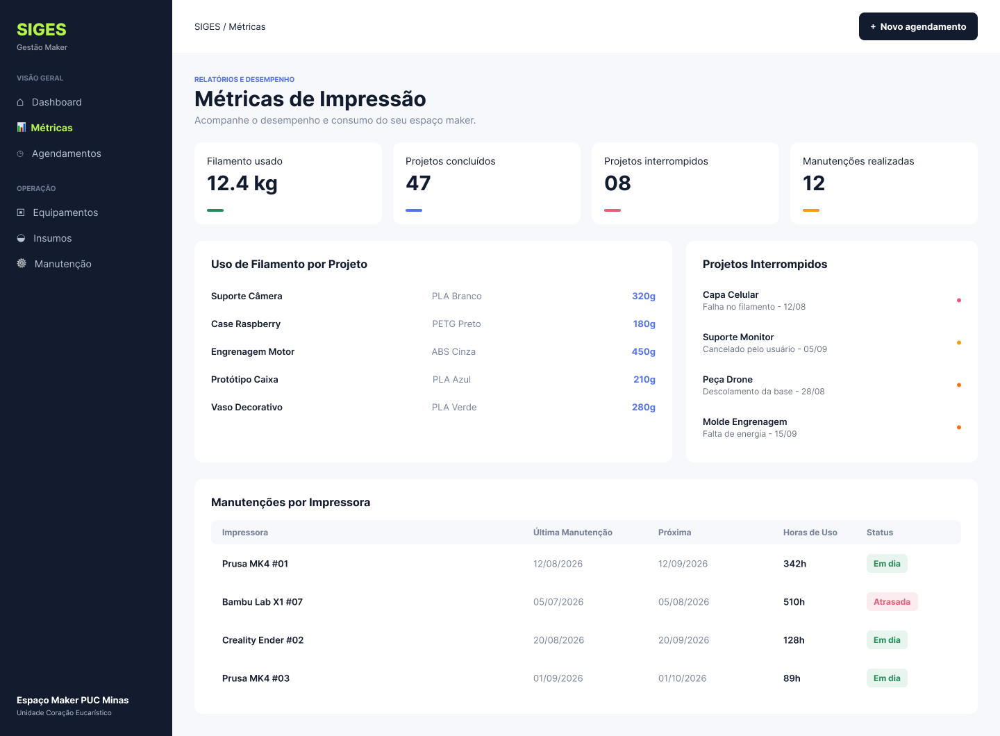

# Protótipos de Telas do Sistema (SIGES)

Apresentam-se a seguir os protótipos de interface desenvolvidos para o Sistema Integrado de Gestão do Espaço Maker (SIGES), contemplando a visão geral (dashboard), agendamento de máquinas, monitoramento de equipamentos, controle de estoque de insumos e análise de métricas operacionais de impressão 3D.

---

### Dashboard (Visão Geral)

    
  Figura 1: Dashboard do Sistema (Fonte: próprio autor)

---

### Módulo de Agendamentos

    
  Figura 2: Gestão de Agendamentos (Fonte: próprio autor)

---

### Módulo de Equipamentos

    
  Figura 3: Gestão e Monitoramento de Equipamentos (Fonte: próprio autor)

---

### Módulo de Insumos

    
  Figura 4: Controle de Insumos e Estoque (Fonte: próprio autor)

---

### Métricas de Impressão

    
  Figura 5: Métricas e Relatórios de Impressão (Fonte: próprio autor)

